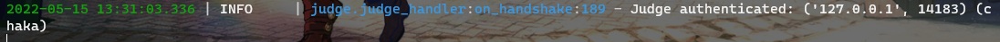
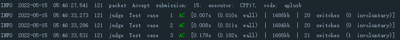

# 如何跑通

## 依赖

- Python 3.8+
- MongoDB Server 4.4+
- Docker

> 您可以在这里下一个最新的本地MongoDB Server安装包：https://www.mongodb.com/try/download/community
> 或是注册个号白嫖512M云储存

> 您可以在这里折腾一个适合您操作系统的Docker：https://www.docker.com/get-started/

## 1. 填写并修改`secret.template.yml`为`secret.yml`

具体项说明可以参考模板文件的注释。

## 2. 确认`config/__init__.py`中的配置

记下`judger_monitor_config`下的端口号，后续步骤中起评测机会用到。

## 3. 起网站端

```
pip3 install -r requirements.txt
python3 svr.py
```

第一次启动网站端时终端会提示您建立一个超管账号，请照做。

如果不满意于已经插入的超管账号，请去数据库中删除名为user的collection再重新启动服务。

[如果需要手工改数据库的话建议下载一个MongoDB Compass](https://www.mongodb.com/try/download/compass)

## 4. 起评测机

> 不要无脑复制粘贴这些命令

构建容器（不要在本仓库根目录下跑下面命令）
```
cd 某些你方便的地方
git clone --recursive https://github.com/DMOJ/judge.git
cd judge/.docker
make judge-tier3
# 这步没有make可以这么写 cd tier3 && docker build --build-arg TAG=master -t dmoj/judge-tier3 -t dmoj/judge-tier3:latest .
```

准备存放问题的文件夹，放入一个a+b试机题

> 你可能有必要检查一下judge_conf.yml里面写的是不是你需要的
```
mkdir 某些你打算放问题的目录
cp assets/judge_conf.yml 某些你打算放问题的目录
cp -r assets/aplusb 某些你打算放问题的目录
```

运行容器
```
docker run \
    --name (Docker中显示的容器名，不用但建议与judge_conf.yml中保持一致) \
    -v (宿主机问题目录):(映射到容器里的绝对目录) \
    --cap-add=SYS_PTRACE \
    -d --restart=always \ 
    dmoj/judge-tier3:latest run \
    -p (网站端的judger连接端口) (网站端的host) 
    -c (容器内的judger_conf.yml的绝对目录，照上文的话是/problems/judge_conf.yml)
```
> 注意如果你需要跳过自测的话，结尾加上 --skip-self-test 选项

> 这里给出一个我在Docker Desktop上起服务的实例命令供参考
```
docker run --name chaka -v D:\SETU\Problems:/problems --cap-add=SYS_PTRACE -d --restart=always dmoj/judge-tier3:latest run -p 19998 host.docker.internal -c /problems/judge_conf.yml --skip-self-test
```

至此，网站端的控制台应该显示有judger连入



## 5. 测试评测功能

网站端的命令台：
```
asyncio.ensure_future(judge_list.gen_judge('aplusb', 'CPP17', '#include<bits/stdc++.h> \n int main(){long long a,b,t;std::cin>>t;while(t--){std::cin>>a>>b;std::cout<<a+b<<std::endl;}return 0;}',None,1))
```

不用管网站端的报错，看docker里的log如果有三条AC记录即为跑通了：



# 短期TODO

## 前端

* [] 精细化Submission的网页，接好websocket
* [] 实现Problem的页面搜索和过滤，找到后退可以返回上一个页面的解决方案
* [] 做SubmissionList网页，提供和ProblemList类似的功能
* [] 整几个logo换掉模板的mock pictures

## 后端

* [] 做好Problem搜索与过滤
* [] 尽快做出用motor的v2接口
* [] 比赛系统
* [] OSS上传下载接口

# 大饼

## 评测机（直接使用dmoj的）

* [x] docker中运行，能够自我还原
* [x] 分布式部署
* [x] 支持交互题（checker grader）（testlib）
* [x] 判活、可靠性保证
* [x] 安全性保证
* [x] 编译环境配置与更新容易


## 后端服务器

* [ ] 单数据库多实例模型支持，登录态互斥
* [ ] 提供web api
* [ ] OSS
* [ ] 验证码系统
* [ ] 操作日志

### 题目档系统

* [ ] 单条详细提交记录（仿洛谷）
* [ ] 批量导入（受信用户）
* [ ] 单条编辑、数据、spj导入（非受信用户需要限制）
* [ ] 标程预导入、在线数据生成（受信用户）
* [ ] 自动处理数据crlf
* [ ] 查看错误原因，或testlib那种错误提示（wrong answer expected '1', found '0'）
* [ ] 代码比较（codeforces那种类似git的Previous Submission和Current Submission的Compare）

### 比赛系统

* [ ] 看榜，外榜
* [ ] 基本的交题与罚时
* [ ] 公告广播（牛客）
* [ ] rejudge，赛时修锅
* [ ] 管理端错误点查看（atcoder）
* [ ] 简易查重
* [ ] Clarification
* [ ] IOI、ACM、CF赛制支持
* [ ] Hack功能
* [ ] 发气球界面
* [ ] 自测接口
* [ ] 封榜、管理员手动解封

## Polygon出题系统

* [ ] 题目导入导出
* [ ] Validator
* [ ] 压力测试、TLE/WA测试
* [ ] issue
* [ ] 版本管理

## 数据库

* [ ] 覆写式合并
* [ ] 备份、恢复
